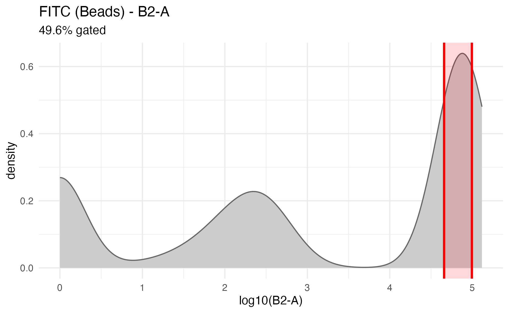

# spectreasy: Full Spectrum Flow Cytometry Quality Control

`spectreasy` is an R package for reviewing single-color controls, building spectral reference matrices, and unmixing experimental samples.

## Key Features

- **Automated Gating**: Isolate positive populations from beads or cells using Gaussian Mixture Models
- **Background Subtraction**: Automatically subtract internal negative populations to isolate pure fluorophore signatures
- **Pre-Unmix SCC Review**: Generate a PDF with per-control gating, histogram, and spectrum diagnostics before unmixing
- **SCC-Variance WLS Unmixing**: Weighted unmixing using detector noise measured from the single-color controls
- **SCC Diagnostics & Visualization**: Spectra, gating plots, and SCC unmixing scatter outputs for control-stage QC
- **Interactive GUI**: Web-based interface for manual matrix adjustment
- **Bioconductor-Native In-Memory Workflows**: `unmix_samples()` accepts `flowSet` and `SingleCellExperiment`, and can return either container

---

## Installation

For the released Bioconductor version, install with:

```r
BiocManager::install("spectreasy")
```

If you need the development version from GitHub, install with:

```r
remotes::install_github("pkheisig/spectreasy")
```

`remotes` is used here rather than `devtools` because only GitHub installation is needed.

---

# Example workflow

This walkthrough demonstrates the primary `spectreasy` workflow on the release-hosted example dataset. The example project contains:

- single-color controls in `scc/`
- one experimental sample in `sample/sample.fcs`

The user-facing workflow is:

1. download the example data into a project directory
2. run `unmix_controls()`
3. review and supplement the generated `fcs_mapping.csv`
4. confirm the control file in the console so `unmix_controls()` can finish
5. run `unmix_samples()`
6. generate QC reports for the controls and unmixed samples (optional)

## 1. Download the example data

`spectreasy_example_data()` downloads the example archive once, caches it under the R user cache, and can copy the extracted files into a project directory for local work.

```r
library(spectreasy)

project_dir <- file.path(tempdir(), "spectreasy_vignette_project")
if (dir.exists(project_dir)) {
  unlink(project_dir, recursive = TRUE, force = TRUE)
}

example_paths <- spectreasy_example_data(dest_dir = project_dir)

list.files(project_dir, recursive = TRUE)
#> [1] "sample/sample.fcs"               "scc/Alexa Fluor 700 (Beads).fcs"
#> [3] "scc/BUV395 (Beads).fcs"          "scc/BV510 (Beads).fcs"          
#> [5] "scc/FITC (Beads).fcs"            "scc/LIVE DEAD NIR (Cells).fcs"  
#> [7] "scc/PerCP-Cy5.5 (Beads).fcs"     "scc/Unstained (Cells).fcs"
```

For the remainder of this walkthrough, the commands are shown as they would be run from the project directory created above.

## 2. Start the control-stage workflow

Run `unmix_controls()` first. If `fcs_mapping.csv` is missing, `auto_create_control = TRUE` creates it automatically and then pauses for review.

```r
setwd(project_dir)

unmix_controls(
  scc_dir = "scc",
  auto_create_control = TRUE,
  cytometer = "Aurora",
  auto_unknown_fluor_policy = "by_channel",
  unmix_method = "WLS",
  unmix_scatter_panel_size_mm = 30,
  save_qc_plots = TRUE
)
```

After the control file is created, `unmix_controls()` prints a confirmation prompt and waits:

```text
Proceed with unmix_controls now? [y/n]:
```

## 3. Review and supplement `fcs_mapping.csv`

Open the generated `fcs_mapping.csv` in the project directory and complete the panel annotation before continuing. At minimum, review these columns:

- `fluorophore`
- `marker`
- `channel`
- `control.type`
- `is.viability`

For the example dataset, the reviewed control file looks like this:

|filename                    |fluorophore     |marker           |channel |control.type |universal.negative |large.gate |is.viability |
|:---------------------------|:---------------|:----------------|:-------|:------------|:------------------|:----------|:------------|
|Alexa Fluor 700 (Beads).fcs |Alexa Fluor 700 |CD3              |R4-A    |beads        |                   |           |             |
|BUV395 (Beads).fcs          |BUV395          |CD45RA           |UV2-A   |beads        |                   |           |             |
|BV510 (Beads).fcs           |BV510           |CD27             |V7-A    |beads        |                   |           |             |
|FITC (Beads).fcs            |FITC            |CD8              |B2-A    |beads        |                   |           |             |
|LIVE DEAD NIR (Cells).fcs   |LIVE DEAD NIR   |Live             |R7-A    |cells        |                   |           |TRUE         |
|PerCP-Cy5.5 (Beads).fcs     |PerCP-Cy5.5     |CCR7             |B9-A    |beads        |                   |           |             |
|Unstained (Cells).fcs       |AF              |Autofluorescence |UV7-A   |cells        |                   |           |             |

## 4. Return to the console and confirm with `y`

Once `fcs_mapping.csv` has been reviewed and saved, return to the console where `unmix_controls()` is waiting and enter:

```text
y
```

The same `unmix_controls()` call then continues and writes the control-stage outputs to `spectreasy_outputs/unmix_controls/`.

```
#>  [1] "fsc_ssc/Alexa Fluor 700 (Beads)_fsc_ssc.png"    
#>  [2] "fsc_ssc/BUV395 (Beads)_fsc_ssc.png"             
#>  [3] "fsc_ssc/BV510 (Beads)_fsc_ssc.png"              
#>  [4] "fsc_ssc/FITC (Beads)_fsc_ssc.png"               
#>  [5] "fsc_ssc/LIVE DEAD NIR (Cells)_fsc_ssc.png"      
#>  [6] "fsc_ssc/PerCP-Cy5.5 (Beads)_fsc_ssc.png"        
#>  [7] "histogram/Alexa Fluor 700 (Beads)_histogram.png"
#>  [8] "histogram/BUV395 (Beads)_histogram.png"         
#>  [9] "histogram/BV510 (Beads)_histogram.png"          
#> [10] "histogram/FITC (Beads)_histogram.png"           
#> [11] "histogram/LIVE DEAD NIR (Cells)_histogram.png"  
#> [12] "histogram/PerCP-Cy5.5 (Beads)_histogram.png"    
#> [13] "scc_detector_noise.csv"
#> [14] "scc_reference_matrix.csv"
#> [15] "scc_spectra.png"
#> [16] "unmixed_fcs/Alexa Fluor 700 (Beads)_unmixed.fcs"
#> [17] "unmixed_fcs/BUV395 (Beads)_unmixed.fcs"
#> [18] "unmixed_fcs/BV510 (Beads)_unmixed.fcs"
#> [19] "unmixed_fcs/FITC (Beads)_unmixed.fcs"
#> [20] "unmixed_fcs/LIVE DEAD NIR (Cells)_unmixed.fcs"
#> [21] "unmixed_fcs/PerCP-Cy5.5 (Beads)_unmixed.fcs"
#> [22] "unmixed_fcs/Unstained (Cells)_unmixed.fcs"
#> [23] "scc_unmixing_matrix.csv"
#> [24] "scc_unmixing_scatter_matrix.png"
#> [25] "spectrum/Alexa Fluor 700 (Beads)_spectrum.png"
#> [26] "spectrum/BUV395 (Beads)_spectrum.png"
#> [27] "spectrum/BV510 (Beads)_spectrum.png"
#> [28] "spectrum/FITC (Beads)_spectrum.png"
#> [29] "spectrum/LIVE DEAD NIR (Cells)_spectrum.png"
#> [30] "spectrum/PerCP-Cy5.5 (Beads)_spectrum.png"
```

Key outputs from this step include:

- `fcs_mapping.csv`
- `spectreasy_outputs/unmix_controls/scc_detector_noise.csv`
- `spectreasy_outputs/unmix_controls/scc_reference_matrix.csv`
- `spectreasy_outputs/unmix_controls/scc_variances.csv`
- `spectreasy_outputs/unmix_controls/scc_spectra.png`
- `spectreasy_outputs/unmix_controls/scc_unmixing_matrix.csv`
- `spectreasy_outputs/unmix_controls/scc_unmixing_scatter_matrix.png`
- `spectreasy_outputs/unmix_controls/fsc_ssc/*.png`
- `spectreasy_outputs/unmix_controls/histogram/*.png`
- `spectreasy_outputs/unmix_controls/spectrum/*.png`
- `spectreasy_outputs/unmix_controls/unmixed_fcs/*.fcs`

The control-stage run also writes visual checks for each single-color control. For one color, the three plots below show the FSC/SSC gate, the peak-channel histogram gate, and the detector spectrum used to build the reference matrix:

<p align="center">
  
  
</p>

<p align="center">
  
</p>

The same run creates the NxN scatter matrix for the single-color controls. Each row is one control, and each column checks how much signal appears in the other unmixed markers.

<p align="center">
  
</p>

### What WLS Uses

When `method = "WLS"`, `spectreasy` uses an event-wise detector-error model: detectors with higher non-negative signal in an event get lower weight for that event. The detector noise floor is estimated from the low-signal tail of the SCC files and written to `scc_detector_noise.csv`; if no estimate is available, `spectreasy` falls back to a scalar floor of 125. The SCC population variances in `scc_variances.csv` are still written as reference QC metadata, but they are not used as default WLS detector weights.

The `control.type` column in `fcs_mapping.csv` also matters for this step. It tells `spectreasy` whether each control should be gated as `beads` or `cells`. If `control.type` is empty, `spectreasy` falls back to filename-based guessing.

## 5. Unmix the experimental sample

After the control-stage workflow has completed, unmix the experimental files with `unmix_samples()`. The reference matrix written by `unmix_controls()` is loaded by default.

```r
unmixed <- unmix_samples(
  sample_dir = "sample",
  output_dir = "spectreasy_outputs/unmix_samples"
)
```

For the example dataset, this writes:

- `spectreasy_outputs/unmix_samples/sample_unmixed.fcs`

and returns a named list with one element per sample.

| Alexa Fluor 700|      BUV395|      BV510|       FITC| LIVE DEAD NIR| PerCP-Cy5.5| AF|File   |
|---------------:|-----------:|----------:|----------:|-------------:|-----------:|--:|:------|
|     -20.0046965|    78.02875|  596.62462|  324.35267|     167.87073|  -212.23328|  0|sample |
|     237.2567103|   554.65499| 1072.44707| -929.98170|     297.11526|   -64.63053|  0|sample |
|       0.7253584|  -340.35803|  172.66508|   10.90629|     -66.49656|  -158.87998|  0|sample |
|     -58.6181900|    31.38628|  681.66951|  263.65788|      16.26860|  -136.49576|  0|sample |
|    8403.7958580| 17036.58226| 2769.59003| 1281.26888|      87.47512|  -338.49202|  0|sample |
|     -74.3725140|  -269.70584|   41.78715|  112.99311|     101.74875|  -145.45809|  0|sample |

## 6. Generate quality control reports (optional)

After unmixing, you can generate comprehensive PDF reports to inspect the quality of both the single-color controls and the unmixed experimental samples.

### Single-Color Control (SCC) Report

The SCC report reviews gating, peak channels, and signal distributions for each control file. By default, it writes the report to `"spectreasy_outputs/unmix_samples/qc_controls_report.pdf"`.

```r
qc_controls(
  scc_dir = "scc",
  cytometer = "Aurora",
  seed = 1
)
```

### Samples Report

The overall sample report visualizes unmixing quality across samples, including spectra overlays, detector residuals, spread matrices, and marker scatter plots. By default, it writes the report to `"spectreasy_outputs/unmix_samples/qc_samples_report.pdf"`.

```r
qc_samples(
  results = unmixed,
  M = ctrl$M
)
```

# Optional steps

The sections below are useful extensions, but they are not required for the core `unmix_controls()` -> `unmix_samples()` workflow shown above.

## Per-cell Autofluorescence (AF) Extraction

By default, `unmix_controls()` and dynamic `unmix_samples()` reference-matrix builds use `af_n_bands = "auto"` to choose autofluorescence signatures from the unstained control. If your cells have different AF shapes from cell to cell, auto can split AF into several basis signatures.

Use the two multi-AF settings in the control-stage call. `af_n_bands` controls how many AF basis signatures are extracted from the unstained control, while `include_multi_af` tells `spectreasy` to include additional AF controls from the `af/` directory when those files are available.

```r
ctrl_multi_af <- unmix_controls(
  scc_dir = "scc",
  control_file = "fcs_mapping.csv",
  cytometer = "Aurora",
  output_dir = "spectreasy_outputs/unmix_controls_multi_af",
  unmix_method = "WLS",
  include_multi_af = TRUE,
  af_n_bands = "auto",
  af_n_bands_sensitivity = 1.5,
  seed = 1
)
```

If you want `unmix_samples()` to rebuild the reference matrix dynamically from the SCC files, pass the same two AF settings there as well:

```r
unmixed_multi_af <- unmix_samples(
  sample_dir = "sample",
  unmixing_matrix_file = NULL,
  scc_dir = "scc",
  control_file = "fcs_mapping.csv",
  method = "WLS",
  include_multi_af = TRUE,
  af_n_bands = "auto",
  af_n_bands_sensitivity = 1.5,
  output_dir = "spectreasy_outputs/unmix_samples_multi_af"
)
```

`af_n_bands` is like choosing how many AF "flavors" to model. More bands can fit complex AF better, but too many similar bands can make the matrix unstable. With `af_n_bands = "auto"`, auto-selection can test up to `af_auto_max_bands = 20` bands by default, then prunes near-duplicate AF signatures before unmixing. If auto repeatedly lands exactly on that maximum, inspect QC and consider increasing `af_auto_max_bands`.

Very small AF k-means clusters are filtered with the larger of `af_min_cluster_events = 20` and `af_min_cluster_proportion = 0.005` of the modeled scatter-gated AF events. That means a tiny cluster must represent at least 20 events and at least 0.5% of the AF events used for extraction.

For more direct control over how many AF bands `"auto"` creates, set `af_n_bands_sensitivity` from `0.1` to `5`. The default `1.5` is balanced. Lower values such as `1` allow more bands, while higher values such as `2.5` or `5` select fewer bands.

## Use a reviewed control CSV in non-interactive workflows

For scripts, reports, or CI jobs, you can supply a pre-existing, reviewed control CSV file via `control_file` to `unmix_controls()` to skip the confirmation prompt.

```r
ctrl_noninteractive <- unmix_controls(
  scc_dir = file.path(project_dir, "scc"),
  control_file = control_file,
  cytometer = "Aurora",
  output_dir = file.path(project_dir, "spectreasy_outputs", "unmix_controls_noninteractive"),
  unmix_method = "WLS",
  seed = 1
)

dim(ctrl_noninteractive$M)
#> [1] 16 64
```

## Pass the in-memory reference matrix directly

You can pass the in-memory reference matrix returned by `unmix_controls()` directly to `unmix_samples()` instead of loading it from the saved CSV file.

For WLS, `unmix_samples()` will also load `scc_detector_noise.csv` beside the saved reference matrix when it is available. The optional `scc_variances.csv` remains useful as control-spread QC metadata.

```r
fluor_reference_matrix <- ctrl$M
marker_map <- stats::setNames(control_df$marker, control_df$fluorophore)
reference_matrix <- fluor_reference_matrix
mapped_names <- marker_map[rownames(reference_matrix)]
na_idx <- is.na(mapped_names)
mapped_names[na_idx] <- rownames(reference_matrix)[na_idx]
rownames(reference_matrix) <- unname(mapped_names)

unmixed_dynamic <- unmix_samples(
  sample_dir = file.path(project_dir, "sample"),
  M = reference_matrix,
  method = "WLS",
  output_dir = file.path(project_dir, "spectreasy_outputs", "unmix_samples_dynamic")
)

names(unmixed_dynamic)
#> [1] "sample"
```

## Inspect quick QC plots

Reference spectra and spectral spread plots should be interpreted in fluorophore space, so the original fluorophore-labeled control matrix is used here.

```r
reference_matrix_no_af <- fluor_reference_matrix[!grepl("^AF($|_)", rownames(fluor_reference_matrix), ignore.case = TRUE), , drop = FALSE]

plot_spectra(reference_matrix_no_af, output_file = NULL)
```

<p align="center">
  
</p>

```r
plot_ssm(calculate_ssm(reference_matrix_no_af), output_file = NULL)
```

<p align="center">
  
</p>

```r
plot_nps(calculate_nps(sample_results), output_file = NULL)
```

<p align="center">
  
</p>

---

**Author**: Paul Heisig  
**Email**: p.k.s.heisig@amsterdamumc.nl
