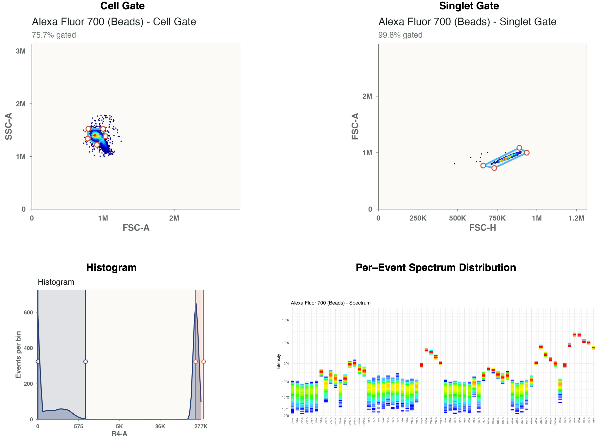
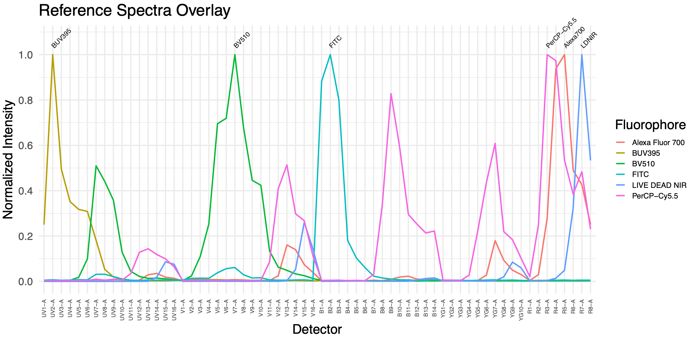
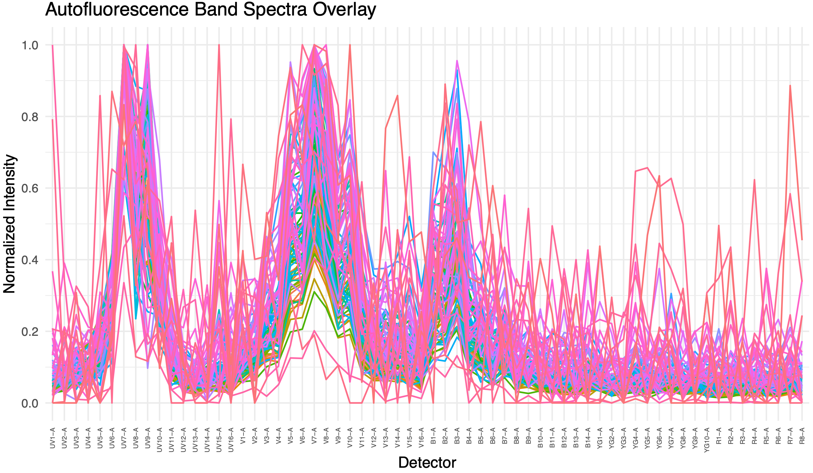

# spectreasy: Spectral Flow Cytometry Umixing and Quality Control

`spectreasy` is an R package for reviewing single-color controls, building spectral reference matrices, unmixing experimental samples, and more.

## Key Features

- **Control Gating**: Gate reference control files in a browser GUI with gates being automatically transferred into the unmixing function
- **Reference Background Handling**: Use unstained cell controls for AF extraction and unstained bead controls as bead backgrounds when present
- **Advanced Unmixing Algorithms**: Spectreasy builds on the `AutoSpectral` idea with per-cell AF matching and spectral variants. In addition, it ajusts AF extraction for each marker, depending on the AF's influence on it.
- **Other Unmixing Algorithms**: OLS, NNLS, WLS and RWLS (robust WLS) are supported
- **SCC Diagnostics & Visualization**: Generate HTML reports by default to inspect SCC spectra, gating plots, and QC metrics, with PDF available through `report_format = "pdf"`
- **Browser Tools**: Interactive control gating, spectral panel builder, and manual matrix adjustment modules
- **Bioconductor-Native In-Memory Workflows**: `unmix_samples()` accepts `flowSet` and `SingleCellExperiment`, and can return either container

---

## Installation

Install with:

```r
remotes::install_github("pkheisig/spectreasy", force = TRUE)

# alternatively
devtools::install_github("pkheisig/spectreasy", force = TRUE)
```

---

# Example workflow

The example project contains:

- single-color controls in `scc/`
- one experimental sample in `samples/sample.fcs`

Summary of the workflow:

1. Download the example data into a project directory (or use your own -> by default, SCCs go into /scc and samples into /samples)
2. Run `unmix_controls()`
3. Review and supplement the generated `fcs_mapping.csv`
4. Confirm the mapping file by typing `y` in the console
5. Perform gating on unstianed and single-color control files via the browser GUI
6. Run `unmix_samples()`
7. Review the QC reports that are generated during unmixing

## 1. Download the example data

`spectreasy_example_data()` downloads the example archive once, caches it under the R user cache, and can copy the extracted files into a project directory for local work.

```r
library(spectreasy)

project_dir <- file.path(tempdir(), "spectreasy_vignette_project")
if (dir.exists(project_dir)) {
  unlink(project_dir, recursive = TRUE, force = TRUE)
}

example_paths <- spectreasy_example_data(dest_dir = project_dir)

list.files(project_dir, recursive = TRUE)
#> [1] "sample/sample.fcs"               "scc/Alexa Fluor 700 (Beads).fcs"
#> [3] "scc/BUV395 (Beads).fcs"          "scc/BV510 (Beads).fcs"          
#> [5] "scc/FITC (Beads).fcs"            "scc/LIVE DEAD NIR (Cells).fcs"  
#> [7] "scc/PerCP-Cy5.5 (Beads).fcs"     "scc/Unstained (Cells).fcs"
```

For the remainder of this walkthrough, the commands are shown as they would be run from the project directory created above.

## 2. Start the control-stage workflow

Run `unmix_controls()` first. If `fcs_mapping.csv` is missing, `auto_create_mapping = TRUE` creates it automatically and then pauses for review.
By default, `manual_gating = TRUE`, so the browser-based gating GUI opens after the mapping file is confirmed. Default parameter values for unmix_controls() are included for clarity. You don't have to type those out.

```r
setwd(project_dir)

ctrl <- unmix_controls(
  scc_dir = "scc",
  auto_create_mapping = TRUE,
  auto_unknown_fluor_policy = "by_channel",
  manual_gating = TRUE,
  unmix_scatter_panel_size_mm = 30,
  save_qc_plots = TRUE
)
```

After the control file is created, `unmix_controls()` prints a confirmation prompt and waits:

```text
Proceed with unmix_controls now? [y/n]:
```

## 3. Review and supplement `fcs_mapping.csv`

Open the generated `fcs_mapping.csv` in the project directory and complete the panel annotation before continuing. At minimum, review these columns:

- `fluorophore`
- `marker`
- `channel`
- `control.type`
- `is.viability`

For the example dataset, the reviewed control file looks like this:

|filename                    |fluorophore     |marker           |channel |control.type |is.viability |
|:---------------------------|:---------------|:----------------|:-------|:------------|:------------|
|Alexa Fluor 700 (Beads).fcs |Alexa Fluor 700 |CD3              |R4-A    |beads        |             |
|BUV395 (Beads).fcs          |BUV395          |CD45RA           |UV2-A   |beads        |             |
|BV510 (Beads).fcs           |BV510           |CD27             |V7-A    |beads        |             |
|FITC (Beads).fcs            |FITC            |CD8              |B2-A    |beads        |             |
|LIVE DEAD NIR (Cells).fcs   |LIVE DEAD NIR   |Live             |R7-A    |cells        |TRUE         |
|PerCP-Cy5.5 (Beads).fcs     |PerCP-Cy5.5     |CCR7             |B9-A    |beads        |             |
|Unstained (Cells).fcs       |AF              |Autofluorescence |UV7-A   |cells        |             |

## 4. Return to the console, confirm with `y`, and gate the controls

Once `fcs_mapping.csv` has been reviewed and saved, return to the console where `unmix_controls()` is waiting and enter:

```text
y
```

The gating GUI then opens in your browser. It shows the controls file by file with a population gate, a singlet gate, and a positive/negative gate where appropriate. Gates can be global across files or made file-specific from the right-click gate menu. Save and Load buttons write/read a gate CSV such as `ssc_gate_config.csv`.

Clicking Confirm saves the gate CSV, closes the GUI server, and lets the same `unmix_controls()` call continue (you need to manually switch back to your IDE).

1) Key outputs from this step include:
- `spectreasy_outputs/unmix_controls/unmixed_fcs/*.fcs` -> your unmixed SCC and unstained control files
- `fcs_mapping.csv` -> SCC and unstained control file mapping
- `ssc_gate_config.csv` -> manual SCC gate definitions when the gating GUI is used
- `spectreasy_outputs/unmix_controls/qc_controls_report.html` -> HTML report with SCC overview and QC plots (see details below)

2) These are already part of `qc_controls_report.html` and only saved separately when `save_qc_plots = TRUE`, so you can use the plot somewhere as a standalone PNG file.
- `spectreasy_outputs/unmix_controls/scc_unmixing_scatter_matrix.png`
- `spectreasy_outputs/unmix_controls/scc_spectra.png`
- `spectreasy_outputs/unmix_controls/scc_af_spectra.png`
- `spectreasy_outputs/unmix_controls/fsc_ssc/*.png` 
- `spectreasy_outputs/unmix_controls/histogram/*.png`
- `spectreasy_outputs/unmix_controls/spectrum/*.png`


The control-stage run also writes visual checks for each single-color control with the gating plots from the GUI included in the control QC report. For one color, the summary below shows the broad FSC/SSC cleanup, the singlet gate, the positive/negative gate, and the per-event detector spectrum used to build the reference matrix:

<p align="center">
  
</p>

The same run creates the NxN scatter matrix for the single-color controls. Each row is one control, and each column checks how much signal appears in the other unmixed markers.

<p align="center">
  
</p>

## 5. Unmix the experimental sample

After the control-stage workflow has completed, unmix the experimental files with `unmix_samples()`. The reference matrix written by `unmix_controls()` is loaded by default. If `scc_spectral_variants.rds` is present beside that matrix, `unmix_samples()` reuses it automatically.

```r
unmixed <- unmix_samples(
  sample_dir = "sample",
  output_dir = "spectreasy_outputs/unmix_samples"
)
```

For the example dataset, this writes:

- `spectreasy_outputs/unmix_samples/sample_unmixed.fcs`

and returns a named list with one element per sample.

| Alexa Fluor 700|      BUV395|     BV510|        FITC| LIVE DEAD NIR| PerCP-Cy5.5|         AF|File   |
|---------------:|-----------:|---------:|-----------:|-------------:|-----------:|----------:|:------|
|        69.30757|    92.68504|  815.3799|   363.95801|     146.16334|   -19.78563|     0.0000|sample |
|        30.20207|   669.77978|  -69.6220| -1712.11376|     156.65262|   695.78227| 11494.0203|sample |
|       -19.07283|  -261.43980|  616.0712|   182.37640|     -56.23331|    93.10464|     0.0000|sample |
|      -103.82067|    78.38529|  496.1857|   146.58977|      67.91341|   -61.55665|  -442.6262|sample |
|      8233.14537| 16461.14920| 1683.2967|  1009.26887|      32.07973|  -257.83746|  3400.9268|sample |
|       -42.85445|  -235.11592| -247.3907|   -55.22978|     218.27591|  -157.39362|   263.2533|sample |

## 6. Review quality control reports

`unmix_controls()` and `unmix_samples()` generate comprehensive HTML reports by default. Set `report_format = "pdf"` when a PDF is preferred:

```r
# HTML is the default
ctrl <- unmix_controls()
unmixed <- unmix_samples()

# Optional PDF output
ctrl_pdf <- unmix_controls(report_format = "pdf")
unmixed_pdf <- unmix_samples(report_format = "pdf")
```

### Single-Color Control (SCC) Report

The SCC report reviews event selection, peak channels, signal distributions, SCC unmixing scatter, and post-unmixing QC. Cell SCCs are compared to unstained cells; bead SCCs are compared to unstained/negative beads when available, otherwise to low-target bead events from the same control.

You can also generate the QC report with a standalone function after unmixing:

```r
qc_controls(
  scc_dir = "scc",
  cytometer = "auto",
  seed = 1
)
```

### Samples Report

The overall sample report visualizes unmixing quality across samples, including spectra overlays, detector residuals, spread matrices, and marker scatter plots.

Similar to SCCs, you can generate the QC report for samples with a standalone function as well:

```r
qc_samples(
  results = unmixed,
  M = ctrl$M
)
```


# Advanced topics

The sections below are for understanding, tuning, or reusing pieces of the workflow.

## Unmixing in spectreasy

By default, `spectreasy` uses `unmixing_method = "Spectreasy"`. The approach builds on AutoSpectral which performs per-event AF matching based on minimizing overall marker leakage, as well as per-event SCC spectral variant matching. For more information, visit [AutoSpectral](https://github.com/DrCytometer/AutoSpectral). The SCC event-selection and variant-detection design is inspired by [Spectracle](https://github.com/nlaniewski/spectracle)

For both `Spectreasy` and `AutoSpectral`, SCC processing starts with the positive histogram population selected in the gating GUI. When no saved positive gate is available, the same automatic histogram fallback is applied. Bright-candidate selection, negative-source resolution, scatter-KNN subtraction, and spectral-shape selection then operate only within that positive population.

The extra Spectreasy step is marker reweighting. For markers that are strongly affected by AF shape, the method leans more on the AutoSpectral-style AF-aware fit. For markers that are relatively clean, it leans more on a marker-only OLS anchor. In practice, this is meant to keep the AF correction helpful without letting it overcorrect clean marker channels.

The Spectreasy blend weight for each marker is calculated from how strongly the AF bank projects through the marker decoder, using a soft-saturation scale controlled by `spectreasy_weight_quantile` (default `0.9`). 


## Other unmixing methods

When you choose `unmixing_method = "RWLS"`, `spectreasy` uses WLS under the hood and, in addition, adjusts the weights after calculating the residuals after unmixing. It does that a number of times specified by the `rwls_max_iter = X` parameter where X is an integer >= 1 (default is 1).

The regular `OLS` and `NNLS` methods remain available as separate methods. They are established algorithms for unmixing and one can find numerous sources on the web for further reading, if desired. 

## Per-cell Autofluorescence (AF) Extraction

`Spectreasy` constructs an AF bank using k-means controlled by `af_n_bands`. By default, `unmix_controls()` uses `af_n_bands = 100` to build a broad AF bank from pooled unstained/AF control events. With one AF band, the AF row is the median normalized AF shape; with multiple AF bands, k-means-derived AF rows represent common AF shapes seen in the unstained cells. During unmixing, each event chooses one AF profile before the final fit.

To use multiple unstained sources, put each unstained cell `.fcs` file in `scc/`. The automapper will identify them as separate AF controls and use one AF row per file in `fcs_mapping.csv`. The events from those files are pooled before AF extraction; `af_n_bands` controls how many AF basis spectra are learned from the pooled events. When using several unstained cell control files (with many events in total) and encountering unmixing issues, one might consider trying a higher value for `af_n_bands`. Note, this can strongly increase the computation time of the unmixing algorithm.

```r
ctrl_multi_af <- unmix_controls(
  scc_dir = "scc",
  control_file = "fcs_mapping.csv",
  cytometer = "Aurora",
  output_dir = "spectreasy_outputs/unmix_controls_multi_af",
  af_n_bands = 100,
  seed = 1
)
```

Then pass the saved control-stage matrix to `unmix_samples()`.
```r
unmixed_multi_af <- unmix_samples(
  sample_dir = "sample",
  unmixing_matrix_file = ctrl_multi_af$reference_matrix_file,
  output_dir = "spectreasy_outputs/unmix_samples_multi_af"
)
```


## AF Profile Library

For reuse across projects, `spectreasy` can store AF profiles in a small global library. This is useful when you have a well-characterized unstained sample or instrument-specific AF profile that you want to inspect, save, reload, and add to a reference matrix.

```r
afp <- extract_af_profile(
  fcs_file = "scc/Unstained (Cells).fcs",
  show_plot = TRUE
)

save_af_profile("aurora_pbmc_baseline", afp, overwrite = TRUE)
list_af_profiles()

saved_af <- load_af_profile("aurora_pbmc_baseline", show_plot = TRUE)
M_with_saved_af <- add_af_profile(ctrl$M, saved_af)
```

Profiles are stored under `af_profile_dir()`, which defaults to the user-level `spectreasy` data directory. Use `plot_af_profile()` to inspect a saved profile and `delete_af_profile()` to remove one.

## Use a reviewed control CSV and gating set in non-interactive workflows

For re-runs (e.g., testing different `af_n_bands` or `unmixing_method`), you can supply pre-existing `fcs_mapping.csv` and `ssc_gate_config.csv` files via the parameters `control_file` and `gating_file` to `unmix_controls()`. This will skip the mapping confirmation prompt and interactive gating GUI.

```r
control_file <- file.path(project_dir, "fcs_mapping.csv")
gating_file = file.path(project_dir, "ssc_gate_config.csv"),

ctrl_noninteractive <- unmix_controls(
  scc_dir = file.path(project_dir, "scc"),
  control_file = control_file,
  gating_file = gating_file,
  manual_gating = FALSE,
  cytometer = "auto",
  output_dir = file.path(project_dir, "spectreasy_outputs", "unmix_controls_noninteractive"),
  seed = 1
)

```

## Pass the in-memory reference matrix directly

You can pass the in-memory reference matrix returned by `unmix_controls()` directly to `unmix_samples()` instead of loading it from the saved CSV file.

For `unmixing_method` WLS and RWLS, `unmix_samples()` will also load `scc_detector_noise.csv` beside the saved reference matrix when it is available.

```r
fluor_reference_matrix <- ctrl$M
control_df <- utils::read.csv(file.path(project_dir, "fcs_mapping.csv"), stringsAsFactors = FALSE)
marker_map <- stats::setNames(control_df$marker, control_df$fluorophore)
reference_matrix <- fluor_reference_matrix
mapped_names <- marker_map[rownames(reference_matrix)]
na_idx <- is.na(mapped_names)
mapped_names[na_idx] <- rownames(reference_matrix)[na_idx]
rownames(reference_matrix) <- unname(mapped_names)

unmixed_direct <- unmix_samples(
  sample_dir = file.path(project_dir, "sample"),
  M = reference_matrix,
  output_dir = file.path(project_dir, "spectreasy_outputs", "unmix_samples_direct")
)

names(unmixed_direct)
#> [1] "sample"
```

## Inspect quick QC plots

```r
reference_matrix_no_af <- fluor_reference_matrix[!grepl("^AF($|_)", rownames(fluor_reference_matrix), ignore.case = TRUE), , drop = FALSE]

plot_spectra(reference_matrix_no_af, output_file = NULL)
```

<p align="center">
  
</p>

```r
af_rows <- grepl("^AF($|_)", rownames(fluor_reference_matrix), ignore.case = TRUE)
plot_spectra(fluor_reference_matrix[af_rows, , drop = FALSE], output_file = NULL)
```

<p align="center">
  
</p>

```r
plot_similarity_matrix(calculate_similarity_matrix(reference_matrix_no_af), output_file = NULL)
```

<p align="center">
  
</p>

---

## Appendix: Other Browser Tools

### Spectral panel builder

`build_panel()` opens a browser-based panel builder backed by packaged theoretical spectra. It currently supports Cytek Aurora, BD FACSDiscover, Sony ID7000, and Thermo Fisher Attune Xenith cytometers. You can use it to view fluorophore spectra, detector overlap, similarity, and panel complexity. Note: This tool estimates fluorophore overlap and panel complexity, but may be less accurate than proprietary panel builders that use hardware-specific parameters.

For Cytek Aurora, the builder can switch between common 5-, 4-, and 3-laser configurations. These are derived from the packaged 5-laser Aurora spectra by keeping only the detectors present on the selected instrument and filtering out fluorophores with too little retained signal.

```r
build_panel()
```

<p align="center">
  
</p>

### Matrix adjustment module

`adjust_matrix()` opens the browser-based matrix adjustment module. By default, it looks for matrix files in `spectreasy_outputs/unmix_controls` under the current working directory, serves bundled browser assets, and runs locally through the R session. You can use it after `unmix_controls()` when you need to inspect or manually adjust an unmixing matrix in the browser to improve subsequent sample unxmixing.

```r
adjust_matrix()

# for unmixing samples make sure to call the explicit filename of the adjusted matrix -> scc_reference_matrix_adjusted.csv
unmix_samples(
  sample_dir = "samples",
  unmixing_matrix_file = file.path(
    "spectreasy_outputs",
    "unmix_controls",
    "scc_reference_matrix_adjusted.csv"
  )
)
```

<p align="center">
  
</p>

---

**Author**: Paul Heisig  
**Email**: p.k.s.heisig@amsterdamumc.nl
