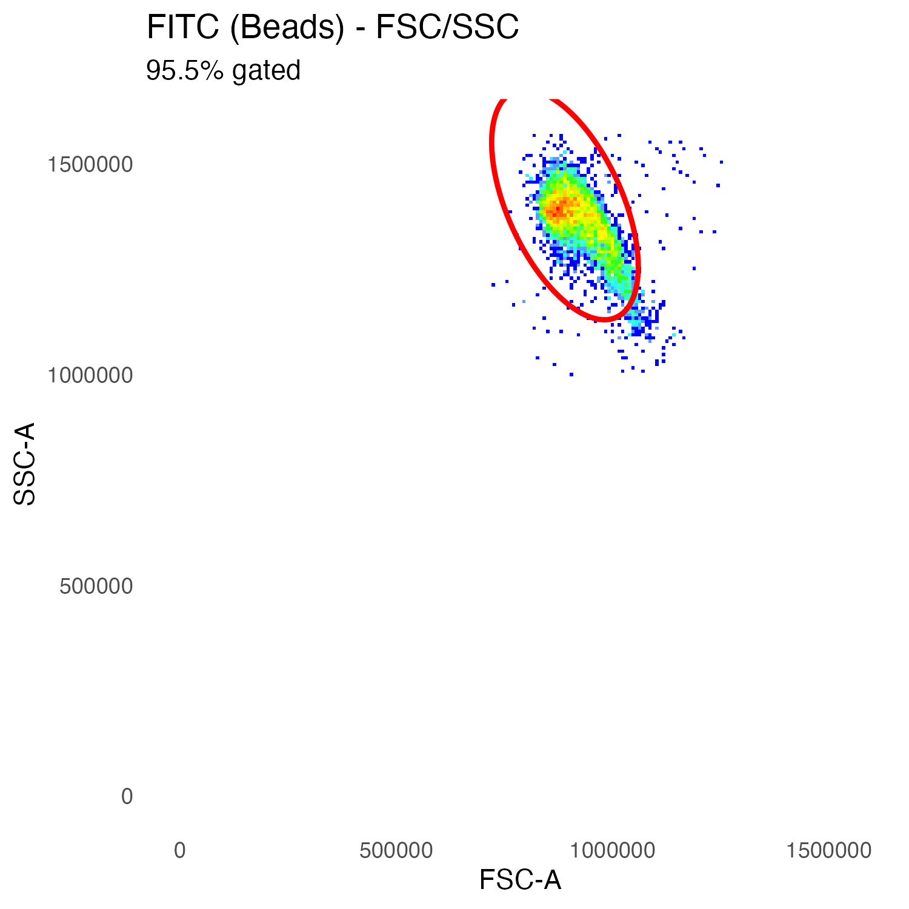
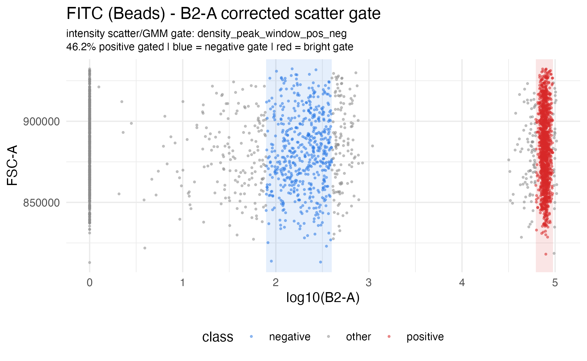
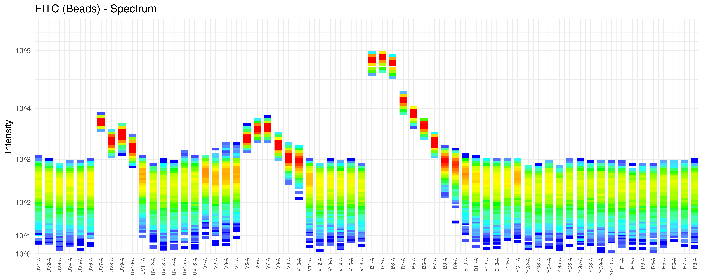
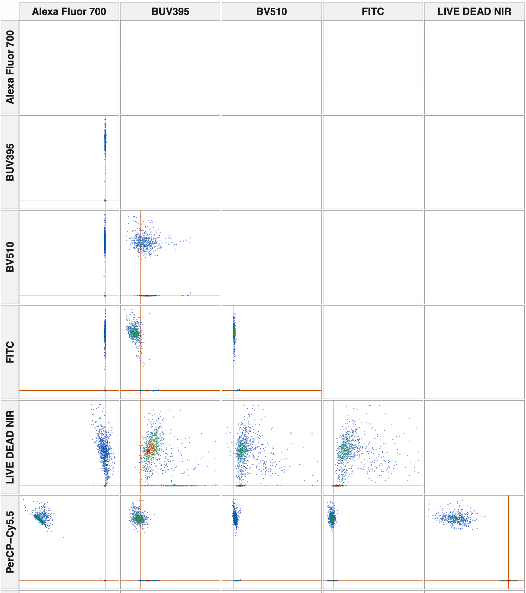
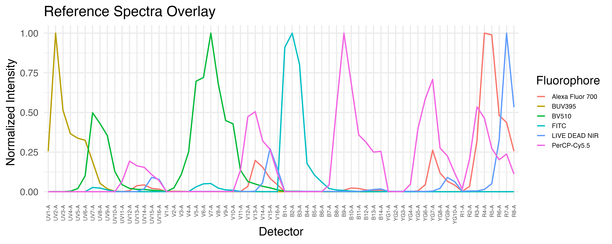
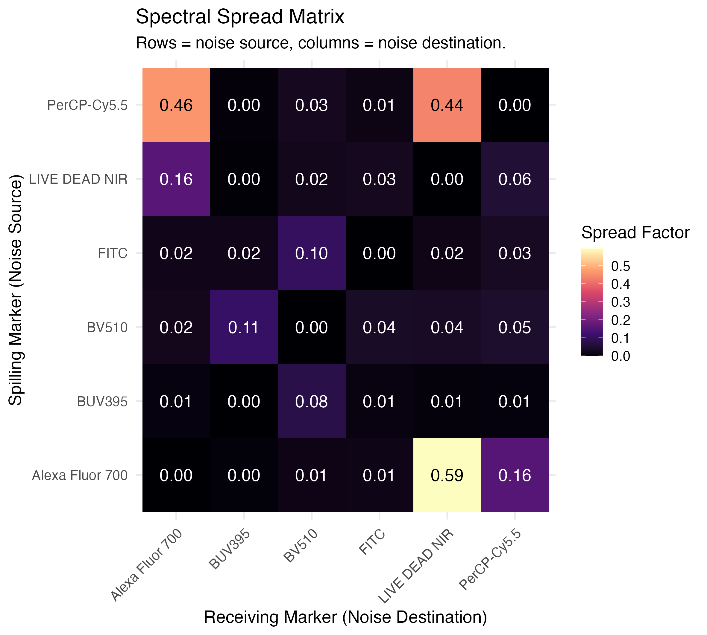
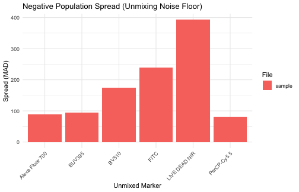
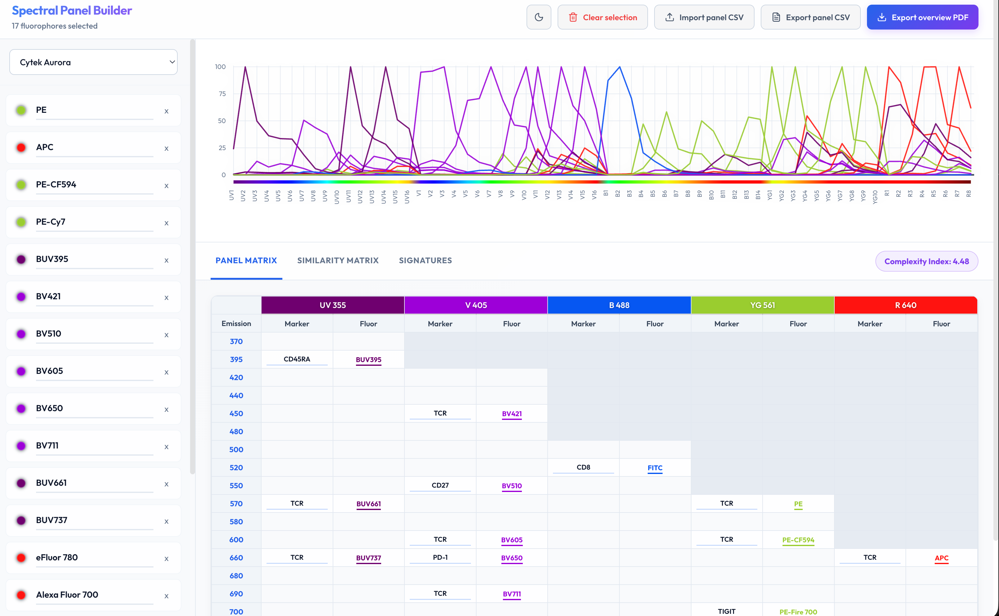
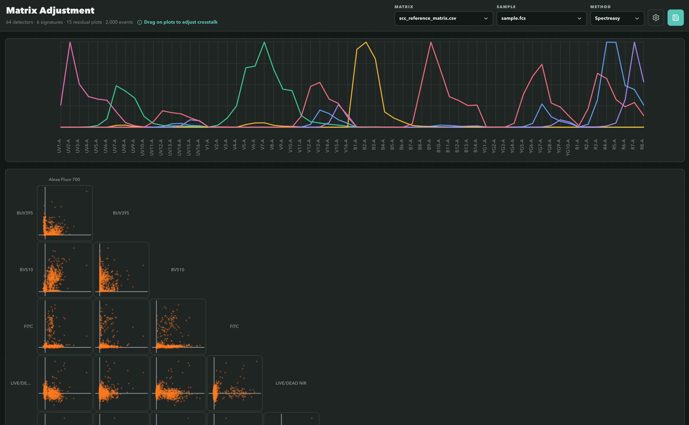

# spectreasy: Full Spectrum Flow Cytometry Quality Control

`spectreasy` is an R package for reviewing single-color controls, building spectral reference matrices, and unmixing experimental samples.

## Key Features

- **Broad Scatter QC**: Remove debris, saturated events, acquisition junk, and extreme FSC/SSC outliers before spectral work
- **Reference Background Handling**: Use unstained cell controls for AF extraction and unstained bead controls as bead backgrounds when present
- **Pre-Unmix SCC Review**: Generate a PDF with per-control event selection, histogram, and spectrum diagnostics before unmixing
- **SCC-Variance WLS Unmixing**: Weighted unmixing using detector noise measured from the single-color controls
- **AutoSpectral by Default**: Per-cell AF matching and fluorophore spectral-variant optimization happen automatically during the control/sample workflow
- **SCC Diagnostics & Visualization**: Spectra, gating plots, and SCC unmixing scatter outputs for control-stage QC
- **Browser Tools**: Interactive spectral panel builder and manual matrix adjustment module
- **Bioconductor-Native In-Memory Workflows**: `unmix_samples()` accepts `flowSet` and `SingleCellExperiment`, and can return either container

---

## Installation

For the released Bioconductor version, install with:

```r
BiocManager::install("spectreasy")
```

If you need the development version from GitHub, install with:

```r
remotes::install_github("pkheisig/spectreasy")
```

`remotes` is used here rather than `devtools` because only GitHub installation is needed.

---

# Example workflow

This walkthrough demonstrates the primary `spectreasy` workflow on the release-hosted example dataset. The example project contains:

- single-color controls in `scc/`
- one experimental sample in `sample/sample.fcs`

The user-facing workflow is:

1. download the example data into a project directory
2. run `unmix_controls()`
3. review and supplement the generated `fcs_mapping.csv`
4. confirm the control file in the console so `unmix_controls()` can finish
5. run `unmix_samples()`
6. review the QC reports that are generated during unmixing by default

## 1. Download the example data

`spectreasy_example_data()` downloads the example archive once, caches it under the R user cache, and can copy the extracted files into a project directory for local work.

```r
library(spectreasy)

project_dir <- file.path(tempdir(), "spectreasy_vignette_project")
if (dir.exists(project_dir)) {
  unlink(project_dir, recursive = TRUE, force = TRUE)
}

example_paths <- spectreasy_example_data(dest_dir = project_dir)

list.files(project_dir, recursive = TRUE)
#> [1] "sample/sample.fcs"               "scc/Alexa Fluor 700 (Beads).fcs"
#> [3] "scc/BUV395 (Beads).fcs"          "scc/BV510 (Beads).fcs"          
#> [5] "scc/FITC (Beads).fcs"            "scc/LIVE DEAD NIR (Cells).fcs"  
#> [7] "scc/PerCP-Cy5.5 (Beads).fcs"     "scc/Unstained (Cells).fcs"
```

For the remainder of this walkthrough, the commands are shown as they would be run from the project directory created above.

## 2. Start the control-stage workflow

Run `unmix_controls()` first. If `fcs_mapping.csv` is missing, `auto_create_control = TRUE` creates it automatically and then pauses for review.

```r
setwd(project_dir)

ctrl <- unmix_controls(
  scc_dir = "scc",
  auto_create_control = TRUE,
  cytometer = "Aurora",
  auto_unknown_fluor_policy = "by_channel",
  unmix_scatter_panel_size_mm = 30,
  save_qc_plots = TRUE
)
```

After the control file is created, `unmix_controls()` prints a confirmation prompt and waits:

```text
Proceed with unmix_controls now? [y/n]:
```

## 3. Review and supplement `fcs_mapping.csv`

Open the generated `fcs_mapping.csv` in the project directory and complete the panel annotation before continuing. At minimum, review these columns:

- `fluorophore`
- `marker`
- `channel`
- `control.type`
- `is.viability`

For the example dataset, the reviewed control file looks like this:

|filename                    |fluorophore     |marker           |channel |control.type |universal.negative |is.viability |
|:---------------------------|:---------------|:----------------|:-------|:------------|:------------------|:------------|
|Alexa Fluor 700 (Beads).fcs |Alexa Fluor 700 |CD3              |R4-A    |beads        |                   |             |
|BUV395 (Beads).fcs          |BUV395          |CD45RA           |UV2-A   |beads        |                   |             |
|BV510 (Beads).fcs           |BV510           |CD27             |V7-A    |beads        |                   |             |
|FITC (Beads).fcs            |FITC            |CD8              |B2-A    |beads        |                   |             |
|LIVE DEAD NIR (Cells).fcs   |LIVE DEAD NIR   |Live             |R7-A    |cells        |                   |TRUE         |
|PerCP-Cy5.5 (Beads).fcs     |PerCP-Cy5.5     |CCR7             |B9-A    |beads        |                   |             |
|Unstained (Cells).fcs       |AF              |Autofluorescence |UV7-A   |cells        |                   |             |

## 4. Return to the console and confirm with `y`

Once `fcs_mapping.csv` has been reviewed and saved, return to the console where `unmix_controls()` is waiting and enter:

```text
y
```

The same `unmix_controls()` call then continues and writes the control-stage outputs to `spectreasy_outputs/unmix_controls/`.

```
#>  [1] "fsc_ssc/Alexa Fluor 700 (Beads)_fsc_ssc.png"
#>  [2] "fsc_ssc/BUV395 (Beads)_fsc_ssc.png"
#>  [3] "fsc_ssc/BV510 (Beads)_fsc_ssc.png"
#>  [4] "fsc_ssc/FITC (Beads)_fsc_ssc.png"
#>  [5] "fsc_ssc/LIVE DEAD NIR (Cells)_fsc_ssc.png"
#>  [6] "fsc_ssc/PerCP-Cy5.5 (Beads)_fsc_ssc.png"
#>  [7] "spectral_selection/Alexa Fluor 700 (Beads)_spectral_selection.png"
#>  [8] "spectral_selection/BUV395 (Beads)_spectral_selection.png"
#>  [9] "spectral_selection/BV510 (Beads)_spectral_selection.png"
#> [10] "spectral_selection/FITC (Beads)_spectral_selection.png"
#> [11] "spectral_selection/LIVE DEAD NIR (Cells)_spectral_selection.png"
#> [12] "spectral_selection/PerCP-Cy5.5 (Beads)_spectral_selection.png"
#> [13] "scc_af_spectra.png"
#> [14] "scc_detector_noise.csv"
#> [15] "scc_reference_matrix.csv"
#> [16] "scc_spectral_variants.rds"
#> [17] "scc_spectra.png"
#> [18] "scc_unmixing_matrix.csv"
#> [19] "scc_unmixing_scatter_matrix.png"
#> [20] "scc_variances.csv"
#> [21] "spectrum/Alexa Fluor 700 (Beads)_spectrum.png"
#> [22] "spectrum/BUV395 (Beads)_spectrum.png"
#> [23] "spectrum/BV510 (Beads)_spectrum.png"
#> [24] "spectrum/FITC (Beads)_spectrum.png"
#> [25] "spectrum/LIVE DEAD NIR (Cells)_spectrum.png"
#> [26] "spectrum/PerCP-Cy5.5 (Beads)_spectrum.png"
#> [27] "unmixed_fcs/Alexa Fluor 700 (Beads)_unmixed.fcs"
#> [28] "unmixed_fcs/BUV395 (Beads)_unmixed.fcs"
#> [29] "unmixed_fcs/BV510 (Beads)_unmixed.fcs"
#> [30] "unmixed_fcs/FITC (Beads)_unmixed.fcs"
#> [31] "unmixed_fcs/LIVE DEAD NIR (Cells)_unmixed.fcs"
#> [32] "unmixed_fcs/PerCP-Cy5.5 (Beads)_unmixed.fcs"
#> [33] "unmixed_fcs/Unstained (Cells)_unmixed.fcs"
```

Key outputs from this step include:

- `fcs_mapping.csv`
- `spectreasy_outputs/unmix_controls/scc_detector_noise.csv`
- `spectreasy_outputs/unmix_controls/scc_reference_matrix.csv`
- `spectreasy_outputs/unmix_controls/scc_spectral_variants.rds`
- `spectreasy_outputs/unmix_controls/scc_variances.csv`
- `spectreasy_outputs/unmix_controls/qc_controls_report.pdf`
- `spectreasy_outputs/unmix_controls/scc_spectra.png`
- `spectreasy_outputs/unmix_controls/scc_unmixing_matrix.csv`
- `spectreasy_outputs/unmix_controls/scc_unmixing_scatter_matrix.png`
- `spectreasy_outputs/unmix_controls/fsc_ssc/*.png`
- `spectreasy_outputs/unmix_controls/intensity_scatter/*.png`
- `spectreasy_outputs/unmix_controls/spectral_selection/*.png` when the experimental AF-cosine selector is enabled, or as an extra diagnostic PNG
- `spectreasy_outputs/unmix_controls/spectrum/*.png`
- `spectreasy_outputs/unmix_controls/unmixed_fcs/*.fcs`

The control-stage run also writes visual checks for each single-color control. For one color, the three plots below show the broad FSC/SSC cleanup, the default GMM/EM scatter gate, and the detector spectrum used to build the reference matrix:

<p align="center">
  
  
</p>

<p align="center">
  
</p>

The same run creates the NxN scatter matrix for the single-color controls. Each row is one control, and each column checks how much signal appears in the other unmixed markers.

<p align="center">
  
</p>

### AutoSpectral in spectreasy

By default, `spectreasy` uses `method = "AutoSpectral"`. In other words, `spectreasy` is using AutoSpectral as the default unmixing strategy, not treating it as a separate manual add-on. During unmixing, AutoSpectral chooses one AF band per cell, tests plausible single-color-control spectral variants for positive fluorophores, and then refits that cell with OLS. The regular `OLS`, `WLS`, `NNLS`, and `RWLS` methods remain available as separate methods.

When you explicitly choose `method = "WLS"`, `spectreasy` uses an event-wise detector-error model: detectors with higher non-negative signal in an event get lower weight for that event. The detector noise floor is estimated from the low-signal tail of the SCC files and written to `scc_detector_noise.csv`; if no estimate is available, `spectreasy` falls back to a scalar floor of 125. The SCC population variances in `scc_variances.csv` are still written as reference QC metadata, but they are not used as default WLS detector weights.

The `control.type` column in `fcs_mapping.csv` also matters for this step. It tells `spectreasy` whether each control should be gated as `beads` or `cells`. If `control.type` is empty, `spectreasy` falls back to filename-based guessing.

With `unmix_method = "AutoSpectral"`, `spectreasy` learns a conservative fluorophore spectral-variant library from the single-color controls and writes it to `scc_spectral_variants.rds`. This follows the same high-level idea as AutoSpectral's per-cell fluorophore spectrum optimization: learn plausible within-fluorophore spectral shapes from controls, then use them when they improve per-cell residuals without overfitting noise. The SCC event-selection and variant-detection design is also inspired by [Spectracle](https://github.com/nlaniewski/spectracle), which separates true spectral signal from AF-like contamination before local AF cleanup.

## 5. Unmix the experimental sample

After the control-stage workflow has completed, unmix the experimental files with `unmix_samples()`. The reference matrix written by `unmix_controls()` is loaded by default. If `scc_spectral_variants.rds` is present beside that matrix, `unmix_samples()` reuses it automatically.

```r
unmixed <- unmix_samples(
  sample_dir = "sample",
  output_dir = "spectreasy_outputs/unmix_samples"
)
```

For the example dataset, this writes:

- `spectreasy_outputs/unmix_samples/sample_unmixed.fcs`

and returns a named list with one element per sample.

| Alexa Fluor 700|      BUV395|     BV510|        FITC| LIVE DEAD NIR| PerCP-Cy5.5|         AF|File   |
|---------------:|-----------:|---------:|-----------:|-------------:|-----------:|----------:|:------|
|        69.30757|    92.68504|  815.3799|   363.95801|     146.16334|   -19.78563|     0.0000|sample |
|        30.20207|   669.77978|  -69.6220| -1712.11376|     156.65262|   695.78227| 11494.0203|sample |
|       -19.07283|  -261.43980|  616.0712|   182.37640|     -56.23331|    93.10464|     0.0000|sample |
|      -103.82067|    78.38529|  496.1857|   146.58977|      67.91341|   -61.55665|  -442.6262|sample |
|      8233.14537| 16461.14920| 1683.2967|  1009.26887|      32.07973|  -257.83746|  3400.9268|sample |
|       -42.85445|  -235.11592| -247.3907|   -55.22978|     218.27591|  -157.39362|   263.2533|sample |

## 6. Review quality control reports

`unmix_controls()` and `unmix_samples()` generate comprehensive PDF reports by default. You can open those files directly, or call the report helpers below when you want to regenerate reports with different paths or limits.

### Single-Color Control (SCC) Report

The SCC report reviews event selection, peak channels, signal distributions, SCC unmixing scatter, and post-unmixing off-target control QC. The post-unmixing pages summarize NPS/spread, false-positive rate, bias, and target-driven slope from the already-unmixed controls. Cell SCCs are compared to unstained cells; bead SCCs are compared to unstained/negative beads when available, otherwise to low-target bead events from the same control. By default, `unmix_controls()` writes it to `"spectreasy_outputs/unmix_controls/qc_controls_report.pdf"`.

```r
qc_controls(
  scc_dir = "scc",
  cytometer = "Aurora",
  seed = 1
)
```

### Samples Report

The overall sample report visualizes unmixing quality across samples, including spectra overlays, detector residuals, spread matrices, and marker scatter plots. By default, `unmix_samples()` writes it to `"spectreasy_outputs/unmix_samples/qc_samples_report.pdf"`.

```r
qc_samples(
  results = unmixed,
  M = ctrl$M
)
```

# Advanced topics

The sections below are for understanding, tuning, or reusing pieces of the workflow. Per-cell AF matching, fluorophore spectral-variant optimization, and QC report generation are already built into the default `unmix_controls()` -> `unmix_samples()` path.

## Per-cell Autofluorescence (AF) Extraction

By default, `unmix_controls()` uses `af_n_bands = "auto"` to build a FlowSOM AF bank from pooled unstained/AF control events. The first AF row is the mean AF profile, and additional SOM-derived AF rows represent common AF shapes seen in the unstained cells. During AutoSpectral unmixing, each event chooses one AF profile before the final OLS fit.

Most users should leave the AF settings at their defaults. To use multiple unstained sources, put each unstained cell `.fcs` file in `scc/` and add one AF row per file to `fcs_mapping.csv`. The files are pooled before AF extraction; `af_n_bands` controls how many AF basis spectra are learned from the pooled events.

```r
ctrl_multi_af <- unmix_controls(
  scc_dir = "scc",
  control_file = "fcs_mapping.csv",
  cytometer = "Aurora",
  output_dir = "spectreasy_outputs/unmix_controls_multi_af",
  af_n_bands = "auto",
  af_auto_max_bands = 100,
  seed = 1
)
```

Then pass the saved control-stage matrix to `unmix_samples()`. `unmix_samples()` does not rebuild missing matrices from SCC files; if the matrix is absent, run `unmix_controls()` first.

```r
unmixed_multi_af <- unmix_samples(
  sample_dir = "sample",
  unmixing_matrix_file = ctrl_multi_af$reference_matrix_file,
  output_dir = "spectreasy_outputs/unmix_samples_multi_af"
)
```

This per-cell AF matching layer follows the AutoSpectral idea of matching AF at the event level, while keeping AF signatures separate from fluorophore spectra in the `spectreasy` reference matrix. For difficult samples with structured AF left after the first pass, `af_refine = TRUE` can append second-pass modulated AF spectra from high-error unstained cells. Keep it off unless benchmark metrics show it helps your panel.

## Per-cell Fluorophore Spectral-Variant Optimization

With `unmix_method = "AutoSpectral"`, `unmix_controls()` learns spectral variants as part of the default method. During the control stage, `spectreasy` looks for reproducible shape differences within each fluorophore control, keeps only variants that remain close to the base spectrum, and saves the result as `scc_spectral_variants.rds`.

For both bead-based and cell-based SCCs, the default event selector keeps a broad FSC/SSC cleanup and then uses a GMM/EM intensity-vs-FSC gate to choose positive and negative events. This conservative default is easier to audit in the QC report because the post-FSC/SSC panel shows the scatter gate that selected the events. Bead-based SCCs use an unstained bead control as their negative background when one is available.

An experimental adaptive AF projection/cosine selector is available for cell-based SCCs, but it is off by default while this behavior is being benchmarked against the auditable GMM/EM gate. When enabled, Spectreasy projects events against the AF basis, scores events by low AF similarity, residual target-channel brightness, and target-channel dominance, then keeps the high-score spectral component instead of selecting a fixed positive fraction. Turn it on only when you want to test SCC selection by "bright enough and least AF-like" events:

```r
ctrl_cosine <- unmix_controls(
  scc_dir = "scc",
  use_af_cosine_scc_selection = TRUE
)
```

Leave `use_af_cosine_scc_selection = FALSE` or omit the argument to use the default GMM/EM selector for both bead and cell SCCs. In experimental mode, `histogram_pct_cells` is treated as a conservative maximum selection cap for the adaptive AF-score selector, not as a fixed percentage to keep. Because this workflow is meant to be AF-aware selection followed by scatter-matched unstained subtraction, Spectreasy automatically re-enables `clean_scc_with_unstained = TRUE` with `scc_background_method = "scatter_knn"` if AF-cosine selection is requested without SCC cleaning.

During `unmix_samples()`, only fluorophores that are positive in a given event are eligible for variant matching. The optimizer tests a small number of candidate variants, accepts a change only when detector residuals improve, and falls back to the base spectrum for weak, negative, noisy, or unsupported events.

This feature is part of `spectreasy`'s AutoSpectral workflow. Its per-cell optimization follows AutoSpectral, and the SCC event-selection and variant-detection strategy is inspired by [Spectracle](https://github.com/nlaniewski/spectracle).

## AF Profile Library

For reuse across projects, `spectreasy` can store AF profiles in a small global library. This is useful when you have a well-characterized unstained sample or instrument-specific AF profile that you want to inspect, save, reload, and add to a reference matrix.

```r
afp <- extract_af_profile(
  fcs_file = "scc/Unstained (Cells).fcs",
  show_plot = TRUE
)

save_af_profile("aurora_pbmc_baseline", afp, overwrite = TRUE)
list_af_profiles()

saved_af <- load_af_profile("aurora_pbmc_baseline", show_plot = TRUE)
M_with_saved_af <- add_af_profile(ctrl$M, saved_af)
```

Profiles are stored under `af_profile_dir()`, which defaults to the user-level `spectreasy` data directory. Use `plot_af_profile()` to inspect a saved profile and `delete_af_profile()` to remove one.

## Use a reviewed control CSV in non-interactive workflows

For scripts, reports, or CI jobs, you can supply a pre-existing, reviewed control CSV file via `control_file` to `unmix_controls()` to skip the confirmation prompt.

```r
control_file <- file.path(project_dir, "fcs_mapping.csv")

ctrl_noninteractive <- unmix_controls(
  scc_dir = file.path(project_dir, "scc"),
  control_file = control_file,
  cytometer = "Aurora",
  output_dir = file.path(project_dir, "spectreasy_outputs", "unmix_controls_noninteractive"),
  seed = 1
)

dim(ctrl_noninteractive$M)
#> [1] 9 64
```

## Pass the in-memory reference matrix directly

You can pass the in-memory reference matrix returned by `unmix_controls()` directly to `unmix_samples()` instead of loading it from the saved CSV file.

For WLS, `unmix_samples()` will also load `scc_detector_noise.csv` beside the saved reference matrix when it is available. `scc_variances.csv` remains useful as control-spread QC metadata.

```r
fluor_reference_matrix <- ctrl$M
control_df <- utils::read.csv(file.path(project_dir, "fcs_mapping.csv"), stringsAsFactors = FALSE)
marker_map <- stats::setNames(control_df$marker, control_df$fluorophore)
reference_matrix <- fluor_reference_matrix
mapped_names <- marker_map[rownames(reference_matrix)]
na_idx <- is.na(mapped_names)
mapped_names[na_idx] <- rownames(reference_matrix)[na_idx]
rownames(reference_matrix) <- unname(mapped_names)

unmixed_direct <- unmix_samples(
  sample_dir = file.path(project_dir, "sample"),
  M = reference_matrix,
  output_dir = file.path(project_dir, "spectreasy_outputs", "unmix_samples_direct")
)

names(unmixed_direct)
#> [1] "sample"
```

## Inspect quick QC plots

Reference spectra and spectral spread plots should be interpreted in fluorophore space, so the original fluorophore-labeled control matrix is used here.

```r
reference_matrix_no_af <- fluor_reference_matrix[!grepl("^AF($|_)", rownames(fluor_reference_matrix), ignore.case = TRUE), , drop = FALSE]

plot_spectra(reference_matrix_no_af, output_file = NULL)
```

<p align="center">
  
</p>

```r
plot_ssm(calculate_ssm(reference_matrix_no_af), output_file = NULL)
```

<p align="center">
  
</p>

```r
sample_results <- do.call(rbind, lapply(unmixed, function(x) x$data))
plot_nps(calculate_nps(sample_results), output_file = NULL)
```

<p align="center">
  
</p>

---

## Appendix: Browser Tools

### Spectral panel builder

`build_spectral_panel()` opens a browser-based panel builder backed by packaged theoretical spectra. It currently supports Cytek Aurora, BD FACSDiscover, Sony ID7000, and Thermo Fisher Attune Xenith libraries.

```r
build_spectral_panel()
```

Use it before an experiment when you want a quick browser view of candidate fluorophore spectra, detector overlap, similarity, and panel complexity.

<p align="center">
  
</p>

### Matrix adjustment module

`adjust_matrix()` opens the browser-based matrix adjustment module. By default, it looks for matrix files in `spectreasy_outputs/unmix_controls` under the current working directory, serves bundled browser assets, and runs locally through the R session.

```r
adjust_matrix()
```

Use it after the automated control-stage workflow when you need to inspect or manually adjust an unmixing matrix in the browser.

<p align="center">
  
</p>

---

## References and Related Work

`spectreasy` uses AutoSpectral as its default unmixing method and builds on common R/Bioconductor flow-cytometry tooling. The SCC event-selection and spectral-variant detection design is additionally inspired by Spectracle:

- [AutoSpectral package website](https://drcytometer.github.io/AutoSpectral/)
- [AutoSpectral GitHub repository](https://github.com/DrCytometer/AutoSpectral)
- Burton OT, Bücken L, De Vuyst L, Humblet-Baron S, Lopez Menoz De Leon A, Khan S, Cerveira J, Dooley J, Liston A. [AutoSpectral improves spectral flow cytometry accuracy through optimised spectral unmixing and autofluorescence-matching at the cellular level](https://www.biorxiv.org/content/10.1101/2025.10.27.684855v1). bioRxiv, 2025.
- [Spectracle by nlaniewski](https://github.com/nlaniewski/spectracle)
- [FlowSOM](https://bioconductor.org/packages/FlowSOM/)
- [flowCore](https://bioconductor.org/packages/flowCore/)

---

**Author**: Paul Heisig  
**Email**: p.k.s.heisig@amsterdamumc.nl
